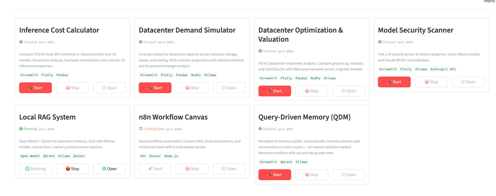

# Chris France

**Operations Manager, Digital Practice & Technology | AECOM**
**PMP | MBA | BS Computer Science — Ohio State**

40 years building and deploying enterprise technology infrastructure — from DOD systems at IBM Federal to Fortune 100 banking consolidations to datacenter operations. Currently leading an 80-person PMO delivering digital infrastructure services and developing AI-powered tools for datacenter planning and optimization.

## AI Demo Portfolio

Hands-on demonstrations combining infrastructure operations experience with modern AI capabilities:

| Demo | Description | Stack |
|------|-------------|-------|
| **Inference Cost Calculator** | Compare TCO for local GPU inference vs. cloud providers over 36 months with break-even analysis and cost-per-1K inference comparison | Python, Streamlit, Plotly, Pandas |
| **Datacenter Demand Simulator** | Forecast enterprise datacenter capacity across compute, storage, power, and cooling with multi-scenario projections and decision timeline analysis | Python, Streamlit, Plotly, Pandas, NumPy, Ollama |
| **Datacenter Optimization & Valuation** | PE/VC datacenter investment analysis — ground-up, modular, and hybrid builds with M&A asset valuation across 14 global markets | Python, Streamlit, Plotly, Pandas, NumPy, Ollama |
| **Model Security Scanner** | Test LLM security across 10 attack categories, scanning Ollama models and Claude API for vulnerabilities | Python, Streamlit, Plotly, Ollama, Anthropic API |
| **Local RAG System** | Chat with Ollama models, upload docs, persistent memory across sessions via WebUI + Qdrant vector search | Open WebUI, Qdrant, Ollama, Docker |
| **n8n Workflow Canvas** | Visual workflow automation — connect APIs, build automations, and orchestrate tasks with a node-based canvas | n8n, Docker, Node.js |
| **Query-Driven Memory (QDM)** | Persistent AI memory system that automatically retrieves relevant past conversations on every query — memories reinforce with use and decay over time | Python, Streamlit, Qdrant, Ollama |

All demos are orchestrated through a unified **Personal Demo Launcher** with start/stop/open controls per project.

## Background

- **AECOM** — Leading 80-person distributed PMO; Consigli US East Regional Coordinator ($390M acquisition)
- **Advance2000** — Founded and scaled SE region to $5.4M revenue; datacenter ops, VMware cloud, Fortune 50 clients
- **Little Diversified** — CIO for 11 years; original Revit beta tester; published author on BIM and cloud
- **Wells Fargo / Bank of America** — IT leadership driving major bank technology consolidations
- **IBM Federal Systems** — Software engineer to program manager on DOD systems

## Publications

- Contributing author, *Mastering Revit Architecture 2011 & 2013* (BIM and the Cloud)
- AECbytes: "BIM and the Cloud" (2010), "Economics of Private Cloud Computing" (2011), "AEC Collaboration Hub" (2012)

## Contact

📧 chris@christopherfrance.com
🔗 [LinkedIn](https://linkedin.com/in/christopherfrance)
